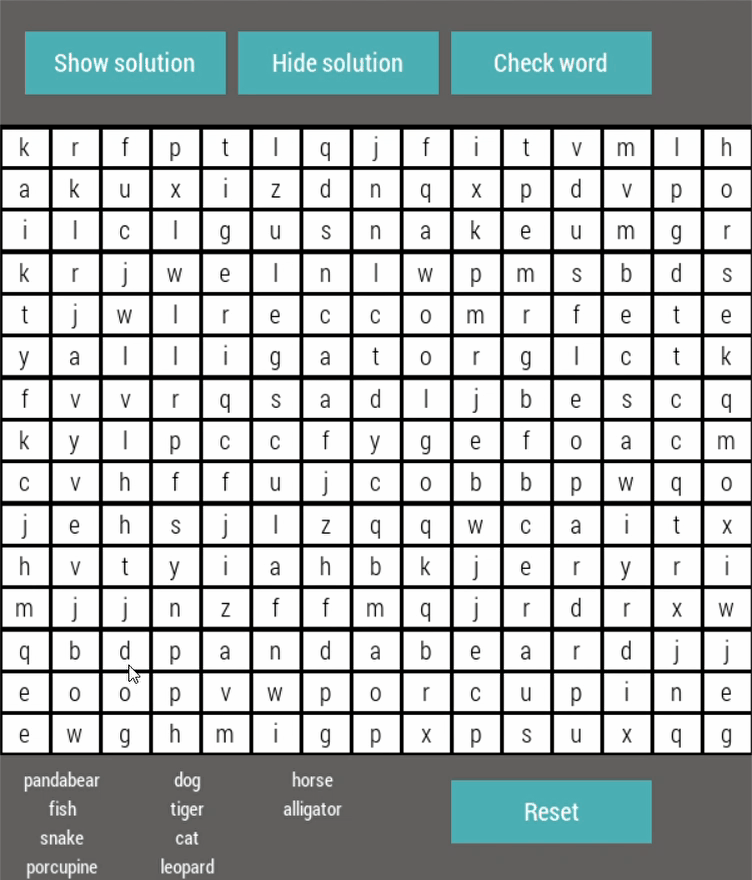

# WordSearchGame

WordSearch ia a fun word search game created with python and its pygame library.  

Features include:

a) Randomized solutions. The word locations are not fixed and are completely random in every run.  
b) Vertical, horizontal and diagonal word alignment supported. 
c) Ability to hide or show solutions. 
d) Words already found are highlighted separately. 

Demo gif below:

